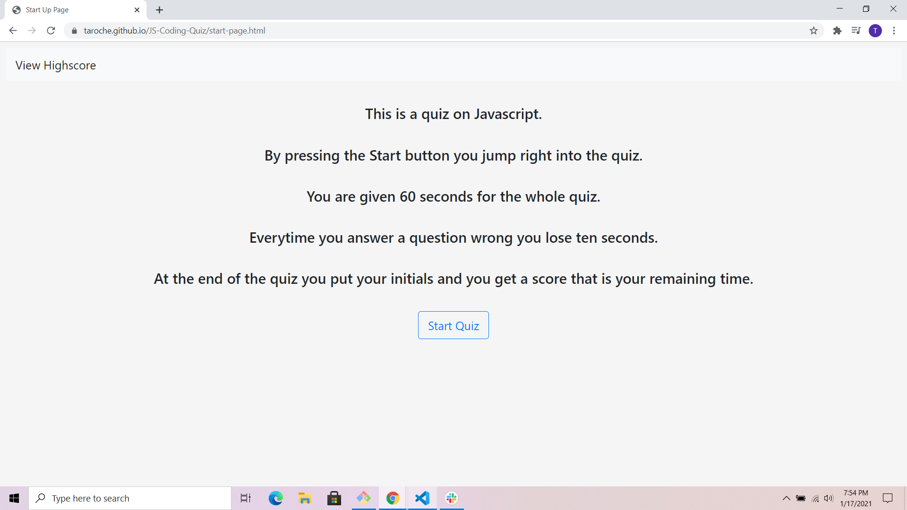

# JS-Coding-Quiz

##Overview
This is a simple Javascript quiz. You start the quiz by pressing the start button. There are five question in total. You move onto the next questions everytime you click and answer no matter if its right or wrong. If it is wrong 10 seconds is subtracted from the highscore. If you answer all the question or run out of time you an input section comes up. When you submit your initials, you are then moved to the highscore page where you can see how you do compare to other people.

##Link
https://taroche.github.io/JS-Coding-Quiz/start-page.html

##Picture

